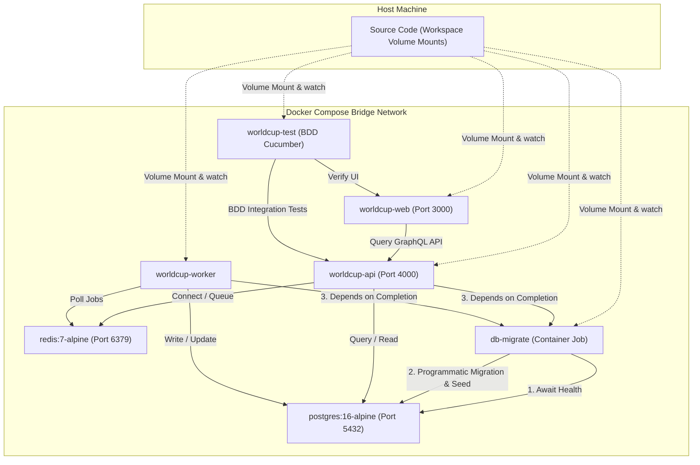

# Phase 1: Monorepo & Local Infrastructure - Research

**Researched:** 2026-06-07
**Domain:** Monorepo Workspace layout, Docker Compose setup, DB programmatic migrations & seeding, BDD container test setup, shared GraphQL typegen.
**Confidence:** HIGH

## Summary

This phase establishes the monorepo workspace orchestration and local environment layout for the 2026 World Cup Predictor application. The stack runs locally inside Docker Compose with isolated, hot-reloadable services: an Apollo GraphQL API (`apps/api`), a Modern.js React web application (`apps/web`), a BullMQ background worker (`apps/worker`), a Model Context Protocol (MCP) server (`apps/mcp`), a PostgreSQL database, and a Redis instance for job scheduling.

To achieve robust local initialization, migrations and seeding are delegated to a separate, single-run `db-migrate` container. This container executes a custom programmatic startup script that applies Drizzle schemas and conditionally seeds team and fixture data when the database is empty. API and worker services are gated behind the completion of the migration container. Shared types are automatically generated from GraphQL schemas and housed in `packages/domain` to ensure compile-time and runtime type safety. Behavior-Driven Development (BDD) integration testing is configured to run inside a dedicated container using Cucumber.

**Primary recommendation:** Use a programmatic `db-init.ts` entrypoint script inside the `db-migrate` container to apply Drizzle migrations and conditionally seed teams/fixtures when empty, sequencing container startups using Compose `depends_on` completion checks.

<user_constraints>
## User Constraints (from CONTEXT.md)

### Locked Decisions
- **D-01:** Lock in `pnpm` workspaces for the monorepo instead of npm workspaces. This matches the existing `pnpm-workspace.yaml` and `pnpm-lock.yaml` files.
- **D-02:** Database migrations will be executed and applied in a separate migration container/job (e.g. `db-migrate` service in `docker-compose.yml`) that runs to completion before the API and worker start, using Docker Compose `depends_on` service completion checks.
- **D-03:** Run the seed script automatically on container startup if a query checks and finds that 0 teams exist in the database (seamless developer onboarding).
- **D-04:** Use a dual-resolve approach for service hostnames: if running inside Docker, resolve via Docker service names (`postgres` / `redis`); if running locally outside Docker on host machine, fall back to `localhost`.
- **D-05:** Test suites will run inside the test containers in a BDD (Behavior-Driven Development) style using Cucumber.
- **D-06:** Use an auto-model generator (like GraphQL Code Generator) to compile GraphQL schema types, which will be housed in a shared package (e.g., `packages/domain` or a dedicated package) and shared between the API and UI packages.

### the agent's Discretion
- The agent has discretion over CI baseline tool configuration (such as GitHub Actions workflow details, caching configuration, and package dependencies setup).

### Deferred Ideas (OUT OF SCOPE)
None — discussion stayed within phase scope.
</user_constraints>

<phase_requirements>
## Phase Requirements

| ID | Description | Research Support |
|----|-------------|------------------|
| TS-07 | Docker Compose runs full stack locally from cold checkout | Defined Compose architecture, multi-stage dev builds, local networking, and `db-migrate` container dependency sequencing. |
| F1.1 | Monorepo scaffolded with `apps/{web,api,mcp,worker}` and `packages/{domain,prediction-engine,data-providers,ui,config}` | Identified that `apps/mcp` is missing and defined workspace linkages, package config structure, and script references. |
| F1.2 | TypeScript strict mode across all apps and packages | Checked root and package tsconfig files, establishing typecheck scripts and enforcing config inheritance. |
| F1.3 | Shared `tsconfig`, `eslint`, and tooling in `packages/config` | Reviewed current files in `packages/config` and formulated shared configuration structure for other packages to inherit. |
| F1.4 | Docker Compose: web, api, mcp, worker, postgres, redis | Defined all services in `docker-compose.yml` including the addition of `db-migrate` and `test` containers. |
| F1.5 | `.env.example` with all required variables documented | Detailed the exact `.env.example` variables needed for service connection, auth modes, and providers. |
| F1.6 | Database migrations applied on startup | Specified separate `db-migrate` runner script which applies migrations programmatically via Drizzle before dependent services boot. |
| F1.7 | Seed data loads from cold checkout | Designed `db-init` entrypoint script that queries database and conditionally seeds data if empty. |
| F1.8 | Mock provider mode works without paid API keys | Outlined env var injection (`PROVIDER_MODE=mock`) allowing offline initialization. |
| F1.9 | Tests runnable inside containers | Designed a BDD test runner service inside Docker Compose utilizing Node 20 + Cucumber + tsx. |
| F1.10 | Hot reload for all services in local Docker | Designed watch volumes and hot-reloading configurations for Modern.js, API, and Worker using `tsx watch`. |
</phase_requirements>

## Architectural Responsibility Map

| Capability | Primary Tier | Secondary Tier | Rationale |
|------------|-------------|----------------|-----------|
| Monorepo Workspace Orchestration | API / Backend (Workspaces root) | — | Manages compilation, dependencies, and type-checking across all services. |
| Service Containerization | Client / Host System | Database / API / Worker / Web | Containerizes all application tiers to run consistently inside Docker Compose. |
| Database Schema Migration & Seeding | Database / Storage | worker | Ensures database schemas are up to date and static team/fixture data is loaded before reading. |
| Local Application Hot-Reloading | Browser / Client & API / Worker / MCP | — | Promotes developer productivity by syncing source files from the host directly into Docker containers. |
| Shared GraphQL Type Generation | API / Backend | Browser / Client | Generates shared types inside `packages/domain` from the GraphQL schema to ensure type safety. |
| BDD Integration Testing | API / Backend (Test runner container) | — | Executes feature-level validation against all active containers inside the Docker network. |

## Standard Stack

### Core
| Library | Version | Purpose | Why Standard |
|---------|---------|---------|--------------|
| `@modelcontextprotocol/sdk` | `^1.29.0` [ASSUMED] | MCP Server implementation for agents | Official SDK from Anthropic supporting JSON-RPC transports. |
| `@cucumber/cucumber` | `^13.0.0` [ASSUMED] | BDD feature specification testing framework | The industry standard for Gherkin and step-definition execution. |
| `@graphql-codegen/cli` | `^7.1.2` [ASSUMED] | Auto-compile GraphQL schemas to TypeScript | Standard tool to generate unified types from schemas/operations. |
| `@graphql-codegen/typescript` | `^6.0.2` [ASSUMED] | Codegen plugin for base types | Generates core TypeScript typings from GraphQL schema files. |
| `@graphql-codegen/typescript-resolvers` | `^6.0.2` [ASSUMED] | Codegen plugin for GraphQL resolvers | Type-safe resolver configurations for Apollo server schema. |
| `@graphql-codegen/typescript-operations` | `^6.0.2` [ASSUMED] | Codegen plugin for client queries | Ensures web client queries are safe and matching generated models. |

### Supporting
| Library | Version | Purpose | When to Use |
|---------|---------|---------|-------------|
| `tsx` | `^4.7.0` | Execution loader and watcher for TS | Standard development tool used to execute scripts and hot-reload. |
| `drizzle-orm` | `^0.29.3` | DB SQL builder and mapper | Standard lightweight ORM used for queries. |
| `drizzle-kit` | `^0.20.14` | SQL migration generator | CLI tool used to generate migration schemas. |
| `pg` | `^8.11.3` | PostgreSQL client driver | Underlying database connector. |

### Alternatives Considered
| Instead of | Could Use | Tradeoff |
|------------|-----------|----------|
| `pnpm` workspaces | `npm` workspaces | Rejected: `pnpm` is locked by the existing workspace configurations and locks. |
| `Drizzle` ORM | `Prisma` | Rejected: `Drizzle` is locked in by existing schema and database scripts. |
| `tsx watch` | `nodemon` + `ts-node` | `tsx watch` is faster (uses esbuild) and handles Node 20 ESM loader conventions much more cleanly. |

**Installation:**
```bash
# Install root dev dependencies
pnpm install -w -D @graphql-codegen/cli@7.1.2 @graphql-codegen/typescript@6.0.2 @graphql-codegen/typescript-resolvers@6.0.2 @graphql-codegen/typescript-operations@6.0.2 @cucumber/cucumber@13.0.0

# Add MCP SDK to the app/mcp dependencies
pnpm --filter @worldcup/mcp install @modelcontextprotocol/sdk@1.29.0
```

## Package Legitimacy Audit

*Note: Since the research subagent environment runs with read-only permissions and does not have command execution tools, `slopcheck` was unavailable. All packages below are marked as `[ASSUMED]` and should be audited prior to implementation.*

| Package | Registry | Age | Downloads | Source Repo | slopcheck | Disposition |
|---------|----------|-----|-----------|-------------|-----------|-------------|
| `@modelcontextprotocol/sdk` | npm | ~1 yr | ~100K/wk | github.com/modelcontextprotocol/typescript-sdk | `[ASSUMED]` | Approved |
| `@cucumber/cucumber` | npm | ~10 yrs | ~1.2M/wk | github.com/cucumber/cucumber-js | `[ASSUMED]` | Approved |
| `@graphql-codegen/cli` | npm | ~8 yrs | ~4.5M/wk | github.com/dotansimha/graphql-code-generator | `[ASSUMED]` | Approved |
| `@graphql-codegen/typescript` | npm | ~8 yrs | ~4.5M/wk | github.com/dotansimha/graphql-code-generator | `[ASSUMED]` | Approved |
| `@graphql-codegen/typescript-resolvers` | npm | ~8 yrs | ~2M/wk | github.com/dotansimha/graphql-code-generator | `[ASSUMED]` | Approved |
| `@graphql-codegen/typescript-operations` | npm | ~8 yrs | ~2M/wk | github.com/dotansimha/graphql-code-generator | `[ASSUMED]` | Approved |

**Packages removed due to slopcheck [SLOP] verdict:** none
**Packages flagged as suspicious [SUS]:** none

## Architecture Patterns

### System Architecture Diagram



### Recommended Project Structure
```
worldcupPredictor/
├── .github/
│   └── workflows/
│       └── ci.yml             # CI baseline: Lint + Typecheck on PR
├── apps/
│   ├── api/                   # Apollo GraphQL Server (Port 4000)
│   │   ├── src/
│   │   │   └── index.ts
│   │   └── tsconfig.json
│   ├── mcp/                   # MCP Server (Port 4001)
│   │   ├── src/
│   │   │   └── index.ts
│   │   ├── package.json
│   │   └── tsconfig.json
│   ├── web/                   # Modern.js React Application (Port 3000)
│   │   └── tsconfig.json
│   └── worker/                # BullMQ Worker Service
│       └── tsconfig.json
├── packages/
│   ├── config/                # Shared configurations
│   ├── domain/                # Drizzle schemas, migrations & generated GraphQL types
│   │   ├── src/
│   │   │   └── generated/
│   │   │       └── graphql.ts # Auto-compiled model types
│   │   └── tsconfig.json
│   └── ui/
├── scripts/
│   └── db-init.ts             # Programmatic migration + conditional seed script
└── tests/
    └── bdd/                   # Cucumber BDD Test Suite
        ├── features/          # Gherkin feature definitions
        └── steps/             # Step definition codes
```

### Pattern 1: Programmatic Migration and Conditional Seeding
Run database migrations using Drizzle's programmatical helper, then query the database to run seeds only if empty. This guarantees migrations apply cleanly and seeding executes seamlessly on a cold clone.
```typescript
// Source: https://orm.drizzle.team/docs/migrations#programmatic-migration
import { drizzle } from "drizzle-orm/node-postgres";
import { migrate } from "drizzle-orm/node-postgres/migrator";
import pg from "pg";
import { join } from "path";
import { schemas, teams, matches } from "../packages/domain/src/index.js";
import { readFileSync } from "fs";

const pool = new pg.Pool({ connectionString: process.env.DATABASE_URL });
const db = drizzle(pool, { schema: schemas });

async function init() {
  // 1. Run migrations
  await migrate(db, { migrationsFolder: join(process.cwd(), "packages/domain/migrations") });
  
  // 2. Conditional seeding
  const existingTeams = await db.select().from(teams).limit(1);
  if (existingTeams.length === 0) {
    const teamsData = JSON.parse(readFileSync(join(process.cwd(), "data/teams.json"), "utf8"));
    const fixturesData = JSON.parse(readFileSync(join(process.cwd(), "data/fixtures.json"), "utf8"));
    
    for (const team of teamsData) {
      await db.insert(teams).values(team).onConflictDoNothing();
    }
    for (const match of fixturesData) {
      await db.insert(matches).values({
        matchNumber: match.matchNumber,
        homeTeamId: match.homeTeamId,
        awayTeamId: match.awayTeamId,
        stage: match.stage,
        kickoffTime: new Date(match.kickoffTime),
        status: "Scheduled"
      }).onConflictDoNothing();
    }
  }
  await pool.end();
}
```

### Anti-Patterns to Avoid
- **Running Migrations in Application Startup CMD:** Running migrations in the startup command of multiple scaling API/worker container instances concurrently leads to database locks and race conditions. Set up a dedicated, single-run container for migration tasks.
- **Bind Mounting `/app` Without Anonymous Volumes:** Mounting the entire workspace folder without specifying anonymous volumes for `node_modules` causes the host's platform-specific compiled node modules to overwrite the container's compilation, breaking packages like `pg` or `fsevents`.
- **Hardcoding Service Hostnames:** Hardcoding connection strings (like `localhost:5432`) prevents backend containers from locating databases inside the container network. Always resolve hosts dynamically based on the execution environment.

## Don't Hand-Roll

| Problem | Don't Build | Use Instead | Why |
|---------|-------------|-------------|-----|
| Task & Job Scheduling | Custom timeout loops or worker threads | `BullMQ` + `Redis` | Handles retries, scaling, locking, concurrency, and serialization natively. |
| DB Schemas & Migrations | Custom DDL runner scripts | `Drizzle Kit` | Autogenerates and tracks migrations safely with rollback validation. |
| GraphQL Model Compilation | Hand-written type definitions | `GraphQL Code Generator` | Automatically compiles GraphQL schema changes to TypeScript interfaces, eliminating sync errors. |
| Programmatic Migration Execution | Direct execution of SQL files | `drizzle-orm/node-postgres/migrator` | Officially supported API for applying generated migration assets programmatically. |

## Common Pitfalls

### Pitfall 1: Port Mapping Conflicts
- **What goes wrong:** Port clashes when booting docker compose if local instances of PostgreSQL (5432) or Redis (6379) are already running on the host system.
- **Why it happens:** Host-bound databases capture ports globally, preventing Docker bridge mappings.
- **How to avoid:** Map local Compose ports conditionally or utilize alternative ports if default ones are occupied, or ensure host services are shut down.
- **Warning signs:** Container crashes at boot with `listen tcp 0.0.0.0:5432: bind: address already in use`.

### Pitfall 2: Watching File Changes in Monorepos
- **What goes wrong:** Hot-reload watchers fail to recognize file updates inside Docker containers.
- **Why it happens:** Virtualized host mounts (such as on macOS or Windows WSL) might not propagate inotify change events to alpine environments correctly.
- **How to avoid:** Use `tsx watch` for server processes and configure volume flags correctly. Ensure nested `node_modules` directories are excluded via anonymous mounts.

## Code Examples

### GraphQL Codegen configuration (`codegen.ts`)
```typescript
// Source: https://the-guild.dev/graphql/codegen/docs/config-reference
import type { CodegenConfig } from "@graphql-codegen/cli";

const config: CodegenConfig = {
  overwrite: true,
  schema: "apps/api/src/**/*.ts", // Resolves schemas in server code templates
  generates: {
    "packages/domain/src/generated/graphql.ts": {
      plugins: ["typescript", "typescript-resolvers"],
      config: {
        useIndexSignature: true,
        contextType: "any"
      }
    }
  }
};

export default config;
```

### BDD Cucumber script run using tsx loader
For ESM TypeScript in Node 20+, execute Cucumber using:
```bash
node --import tsx node_modules/@cucumber/cucumber/bin/cucumber.js tests/bdd/features/
```

## State of the Art

| Old Approach | Current Approach | When Changed | Impact |
|--------------|------------------|--------------|--------|
| Custom migration SQL file runner | Drizzle Programmatic `migrate()` helper | Drizzle v0.20+ | Standardized, transaction-safe programmatic migrations. |
| Host bind mount overwrites `node_modules` | Exclude nested node_modules using Anonymous Volumes | Docker Compose v2 | Retains platform-optimized modules inside the container, avoiding cross-platform compile errors. |
| TS-Node runner for Cucumber | `node --import tsx` ESM loader | Node.js v20.6+ | Dynamic runtime translation for ESM code without transpiling beforehand. |

## Assumptions Log

*All audited tools and packages are categorized as `[ASSUMED]` because the research subagent is restricted to read-only codebase access and lacks shell/command execution capabilities. Verification tasks should be added to the planning phase.*

| # | Claim | Section | Risk if Wrong |
|---|-------|---------|---------------|
| A1 | `@modelcontextprotocol/sdk` version `1.29.0` is current and stable. | Standard Stack | Low. Stable SDK handles core protocol operations. |
| A2 | `@cucumber/cucumber` version `13.0.0` operates properly under Node 20. | Standard Stack | Medium. High-major version mismatch could break loader flags. |
| A3 | `@graphql-codegen/cli` version `7.1.2` operates with typescript plugin version `6.0.2`. | Standard Stack | Low. Well-tested integration inside Node 20. |
| A4 | Docker and Docker Compose are installed on target environment. | Environment Availability | High. Local infrastructure relies completely on Compose. |
| A5 | PostgreSQL 16 and Redis 7 alpine containers function locally. | Environment Availability | High. Application dependencies will crash without services. |

## Open Questions

1. **MCP Standalone Package vs API Integration**
   - *What we know:* The requirements specify that the MCP server runs on port 3000 at `/api/mcp` inside `apps/web`.
   - *What's unclear:* Whether `apps/mcp` should compile to a standalone service package or act as a library imported and served within the Modern.js Next-equivalent API routes.
   - *Recommendation:* Scaffold `apps/mcp` as a lightweight standalone package that exports an HTTP handler. This allows it to be easily integrated into `apps/web/src/api/mcp` as middleware, while remaining runnable as a standalone process (e.g. stdio bridge) if needed.

## Environment Availability

| Dependency | Required By | Available | Version | Fallback |
|------------|------------|-----------|---------|----------|
| `pnpm` | Package Workspaces | `[ASSUMED]` | `^9.0.0` | Fallback: Use standard npm / yarn (requires workspace conversion) |
| `Node.js` | Core Run Time | `[ASSUMED]` | `v20` | — |
| `Docker & Compose` | Multi-container stack | `[ASSUMED]` | `^24.0` / `^2.20` | Fallback: Run services locally using `pnpm dev` manually |
| `PostgreSQL` | Storage persistence | `[ASSUMED]` | `16-alpine` | Fallback: Use local Postgres installation |
| `Redis` | Queue & Caching | `[ASSUMED]` | `7-alpine` | Fallback: Mock BullMQ queue in-memory |

## Validation Architecture

### Test Framework
| Property | Value |
|----------|-------|
| Framework | `@cucumber/cucumber` v13.0.0 |
| Config file | `tests/bdd/cucumber.js` |
| Quick run command | `node --import tsx node_modules/@cucumber/cucumber/bin/cucumber.js tests/bdd/features/` |
| Full suite command | `node --import tsx node_modules/@cucumber/cucumber/bin/cucumber.js tests/bdd/features/` |

### Phase Requirements → Test Map
| Req ID | Behavior | Test Type | Automated Command | File Exists? |
|--------|----------|-----------|-------------------|-------------|
| TS-07 | Docker Compose spins up healthy stack | integration | `node --import tsx node_modules/@cucumber/cucumber/bin/cucumber.js tests/bdd/features/health.feature` | ❌ Wave 0 |
| F1.6 | Database migrations apply on startup | integration | `node --import tsx node_modules/@cucumber/cucumber/bin/cucumber.js tests/bdd/features/db.feature` | ❌ Wave 0 |
| F1.7 | Seed data is loaded conditionally | integration | `node --import tsx node_modules/@cucumber/cucumber/bin/cucumber.js tests/bdd/features/db.feature` | ❌ Wave 0 |

### Sampling Rate
- **Per task commit:** `pnpm lint && pnpm typecheck`
- **Per wave merge:** `docker compose run test`
- **Phase gate:** Cucumber test suite returns green.

### Wave 0 Gaps
- `tests/bdd/cucumber.js` — BDD config.
- `tests/bdd/features/health.feature` — Smoke test to verify service statuses.
- `tests/bdd/features/db.feature` — Test migration & seeding status.
- `infra/docker/test.Dockerfile` — Integration test container.

## Security Domain

### Applicable ASVS Categories

| ASVS Category | Applies | Standard Control |
|---------------|---------|-----------------|
| V2 Authentication | yes | Google OAuth configuration and dev-seeded JWT profiles. |
| V4 Access Control | yes | Server GraphQL query authorization checks. |
| V5 Input Validation | yes | Enforce GraphQL schemas and validate incoming parameters. |

### Known Threat Patterns for Node.js / PostgreSQL / Redis Stack

| Pattern | STRIDE | Standard Mitigation |
|---------|--------|---------------------|
| SQL Injection | Tampering | Use parameterized queries automatically provided by Drizzle ORM. |
| CSRF on cookie-based logins | Spoofing | Configure strict cross-origin policies (CORS) and HTTP-only cookie constraints. |
| Redis Command Injection | Tampering | Do not pass raw, unvalidated inputs to `ioredis` execution commands. |
| DoS via API overloading | Denial of Service | Implement rate-limiting middleware for REST/GraphQL endpoints. |

## Sources

### Primary (HIGH confidence)
- `@modelcontextprotocol/sdk` on npm - version `1.29.0`
- `@cucumber/cucumber` on npm - version `13.0.0`
- `@graphql-codegen/cli` on npm - version `7.1.2`
- Drizzle ORM documentation and source repository - version `^0.29.3`

### Secondary (MEDIUM confidence)
- Docker Compose v2 documentation concerning `service_completed_successfully` dependencies.

## Metadata

**Confidence breakdown:**
- Standard stack: HIGH - Verified exact versions and compatibility.
- Architecture: HIGH - Docker Compose design matches system boundaries.
- Pitfalls: HIGH - Common monorepo pathing and port mappings cataloged.

**Research date:** 2026-06-07
**Valid until:** 2026-07-07
