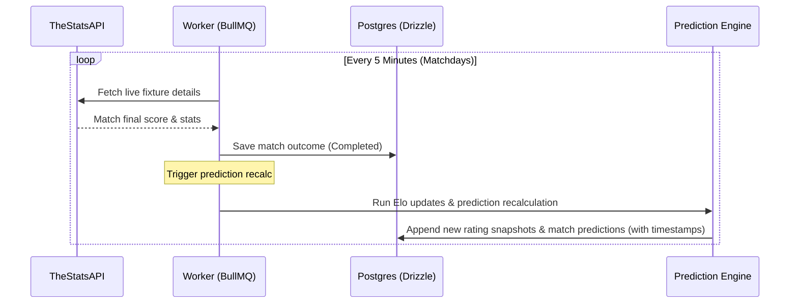

# Application Architecture — 2026 World Cup Predictor

This document outlines the high-level system architecture, component responsibilities, data flows, and technologies for the **2026 World Cup Predictor** web application.

For detailed design proposals and rationale, see [docs/rfc-0001-architecture.md](file:///Users/rony/dev/worldcupPredictor/docs/rfc-0001-architecture.md).

---

## Architecture Overview

The system is designed as a modular monorepo using npm workspaces. It consists of multiple independent applications (web, api, worker) that share logic via packages (domain, prediction-engine, data-providers, ui, config). The remote MCP server is integrated directly into the web application's BFF (Backend-For-Frontend) layer.

```text
+------------------------------------+
|         Modern.js Web App          |
|  (Port 3000: UI & Web MCP Server)  |
+-----------------+------------------+
                  |
                  | Queries & Mutations
                  | (GraphQL Requests)
                  v
+-----------------+------------------+
|      Apollo GraphQL API Server     |
|             (Port 4000)            |
+--------+------------------+--------+
         |                  |
         | Reads/           | Enqueues
         | Writes           | Jobs
         v                  v
   +-----+----+         +---+---+
   | Postgres |         | Redis |
   | Database |         | Queue |
   | (Drizzle |         |   &   |
   |   ORM)   |         | Cache |
   +-----^----+         +---^---+
         |                  |
         | Updates          | Processes
         | DB               | Jobs
   +-----+------------------+--------+
   |      BullMQ Worker Service      |<--- Syncs Data --- [ TheStatsAPI ]
   |           (Background)          |
   +---------------------------------+
```

---

## System Layer Architecture

The architecture is structured in a 5-layer stacked design. Each layer has a clear boundary of responsibility and dependencies flow strictly downward (or toward infrastructure components).

```text
========================================================================
1. PRESENTATION & AGENT ACCESS LAYER
------------------------------------------------------------------------
   [ apps/web (Modern.js Web App) ] ---> Consumes Shared UI
     - Port 3000: User-Facing UI
     - Port 3000: Web MCP Server Endpoint (/api/mcp)
                  |
                  +------------------------> [ packages/ui (Material UI) ]
                  |
==================|=====================================================
2. API LAYER
------------------|-----------------------------------------------------
                  v
   [ apps/api (Apollo GraphQL Server) ]
     - Port 4000: GraphQL API for Web App UI
                  |
                  | Query /
                  | Mutation
==================|=====================================================
3. ASYNC PROCESSING LAYER
------------------|-----------------------------------------------------
                  |
                  |                [ apps/worker ]
                  |               (BullMQ Worker)
                  |                      |
==================|======================|==============================
4. DOMAIN & ENGINE LAYER                 |
------------------|----------------------|------------------------------
                  |         Calculations |
                  |         +------------+
                  v         v
   [ packages/prediction-engine ]  [ packages/data-providers ]
                  |                              |
                  +--------------+---------------+
                                 v
                     [ packages/domain (Types) ]
                                 |
=================================|======================================
5. INFRASTRUCTURE & PERSISTENCE LAYER |
---------------------------------|--------------------------------------
                  v              v
            [( PostgreSQL )]  [( Redis Queue )]    [ TheStatsAPI REST API ]
             (Drizzle ORM)     (BullMQ & Cache)
========================================================================
```

### Layer Responsibilities

1.  **Presentation & Agent Access Layer (`apps/web`, `packages/ui`):**
    *   Responsible for rendering views, managing client-side interactive state, and styling.
    *   Exposes the Web MCP Server for agents and developer CLI tools under `/api/mcp` (or similar BFF endpoint) on Port 3000.
    *   Consumes the Apollo GraphQL layer for both UI data and Web MCP tools/resources. It does not perform any direct database reads.

2.  **API Layer (`apps/api`):**
    *   Exposes secure GraphQL endpoints to the Web App.
    *   Serves the Web App with precise, nested query definitions.

3.  **Async Processing Layer (`apps/worker`):**
    *   Coordinates time-based and event-driven tasks.
    *   Syncs data from data providers, manages scheduled jobs, and drives prediction recalculations.

4.  **Domain & Engine Layer (`packages/prediction-engine`, `packages/data-providers`, `packages/domain`):**
    *   Hosts the pure business logic and rating models of the project.
    *   Performs numerical ratings calculations, probability calculations, and translates provider-specific responses into the project's standard internal schema.

5.  **Infrastructure & Persistence Layer (Postgres + Drizzle, Redis, TheStatsAPI):**
    *   Handles low-level data persistence, message brokering, caching, and external REST requests.

---


## Monorepo Layout

The project structure is organized as follows:

```
worldcupPredictor/
├── apps/
│   ├── web/                   # Modern.js UI + Web MCP Server (port 3000)
│   ├── api/                   # Apollo GraphQL API Server (port 4000)
│   └── worker/                # BullMQ background worker service
├── packages/
│   ├── domain/                # Shared domain models, constants, and validation schemas
│   ├── prediction-engine/     # Elo ratings and match probability calculation engine
│   ├── data-providers/        # TheStatsAPI client, mock provider, and normalization layer
│   ├── ui/                    # Shared Material UI theme configuration and custom component library
│   └── config/                # Shared linting, formatting, and TypeScript configurations
├── infra/
│   ├── docker/                # Service-specific Dockerfiles
│   └── compose/               # Docker Compose environments (local development stack)
└── scripts/                   # Seeding, manual sync, and execution scripts
```

---

## Tech Stack & Core Choices

*   **Frontend:** [Modern.js](https://modernjs.dev/) with React and TypeScript.
*   **Styling:** Material UI (MUI) component library and custom theme engine. **No Tailwind CSS**.
*   **API Layer:** Apollo GraphQL server.
*   **Database:** Postgres with [Drizzle ORM](https://orm.drizzle.team/) for lightweight, type-safe SQL queries.
*   **Background Jobs:** [BullMQ](https://bullmq.io/) backed by Redis for queueing, rate limiting, and synchronization locks.
*   **Data Provider:** [TheStatsAPI](https://www.thestatsapi.com/) for tournament fixtures, teams, squads, live stats, lineups, player stats, and xG.
*   **Odds Provider:** The Odds API for display-only market context.
*   **Authentication:** Google OAuth 2.0 (production) alongside a dev-mode seeded identity (local Docker).

---

## Service Components

### 1. Modern.js Web App (`apps/web`)
*   **Port:** `3000`
*   **Role:** User-facing tournament dashboard + Web MCP Server + AI-renderable UI widgets.
*   **Details:** Displays upcoming fixtures, live match states, prediction percentages, and odds comparisons. Exposes a `/api/mcp` Streamable HTTP endpoint for AI agents. Queries the GraphQL API on port 4000 to resolve all UI views as well as all MCP resources, tools, and renderable widgets. It performs no direct database queries.
*   **AI-renderable UI:** The Web MCP server should expose compact UI resources that compatible AI tools can render inline, such as match prediction cards, match detail panels, team summaries, group tables, bracket previews, and model metrics panels. These widgets are backed by MCP tool results and GraphQL data, not direct database access.

### 2. Apollo GraphQL API (`apps/api`)
*   **Port:** `4000`
*   **Role:** Read/write interface for the web app UI.
*   **Details:** Handles queries and mutations, user sessions (Google OAuth), and database writes via Drizzle.

### 3. Background Worker (`apps/worker`)
*   **Role:** Orchestrates asynchronous jobs and schedules.
*   **Details:** Run by BullMQ. Responsible for:
    *   Periodic data synchronization from TheStatsAPI (fixtures, lineups, stats).
    *   Post-match processing: finalizing matches, running the rating calculations, and storing new predictions.
    *   Syncing market odds data for display purposes.

---

## Core Data Flows

### Match Update & Prediction Pipeline



1.  **Sync:** The background worker polls TheStatsAPI for live match events and final results.
2.  **State Change:** When a match is completed, its status is updated in the database.
3.  **Calculation:** The worker invokes `packages/prediction-engine` to update both national team Elo ratings and individual player influence scores.
4.  **Historical Preservation:** New ratings and predictions are written to the database. Old records are **never overwritten**; they are stored as historical versions with timestamps to facilitate performance tracking over time.

### Odds Synchronization
*   Odds are periodically ingested from The Odds API.
*   Odds are strictly **display-only** to provide market context and compare Elo probability with implied market probability.
*   **No gambling features:** The application does not offer betting options, and odds data is presented neutrally. If the odds API is unavailable, the UI gracefully degrades by hiding the odds section.

---

## Domain-Driven Design (DDD) Architecture

The core codebase adopts Domain-Driven Design (DDD) principles to organize business logic, enforce clear system boundaries, and isolate third-party API dependencies.

```text
+-----------------------------------------------------------------------+
|                       BOUNDED CONTEXT BOUNDARIES                       |
+-----------------------------------------------------------------------+
|                                                                       |
|  [ Tournament Context ]                 [ Prediction Context ]        |
|    - Match (Aggregate Root)              - Prediction (Aggregate Root)|
|    - Team (Entity)                       - RatingSnapshot (Entity)    |
|    - Player (Entity)                     - Probabilities (Value Obj)  |
|                                                                       |
|                     \                         /                       |
|                      \                       /                        |
|                       v                     v                         |
|                 +---------------------------------+                   |
|                 |    Prediction Domain Service    |                   |
|                 +---------------------------------+                   |
|                                  ^                                    |
|                                  | Reads/Writes                       |
|                                  v                                    |
|                       +---------------------+                         |
|                       |   Drizzle Schema    |                         |
|                       |  (Persisted Domain) |                         |
|                       +---------------------+                         |
|                                  ^                                    |
|                                  | Translates to Domain               |
|                       +---------------------+                         |
|                       | Anti-Corruption (ACL) |                       |
|                       +---------------------+                         |
|                                  ^                                    |
|                                  | External REST                      |
|                           [ TheStatsAPI ]                             |
+-----------------------------------------------------------------------+
```

### 1. Bounded Contexts

We isolate business terminology and rules into three distinct Bounded Contexts:
1.  **Tournament Context:** Encompasses the physical reality of the World Cup — fixtures, real-time match events, rosters, team groups, standings, and completed match results.
2.  **Prediction Context:** Handles Elo-rating estimations, forecast probabilities, historical performance audit logs, and prediction reasoning.
3.  **Odds Context:** Represents external market betting metrics. It remains strictly read-only and is decoupled from prediction forecasts.

### 2. Domain Objects (Aggregates, Entities, and Value Objects)

#### A. Tournament Context
*   **Match (Aggregate Root):** Combines fixture data, live stats, lineups, and final scores. It acts as the gatekeeper for match state transitions (e.g., transitions from `Scheduled` to `Live` to `Completed`).
*   **Team (Entity):** Defined by a stable country ID (e.g., `ARG`, `FRA`), country name, flag, and group placement.
*   **Player (Entity):** Linked to a national squad roster. Holds performance metrics used to evaluate player influence.

#### B. Prediction Context
*   **Prediction (Aggregate Root):** An immutable, append-only snapshot of match outcome probabilities forecasted by the model. A new forecast is created for every match status change or rating update.
    *   **Probabilities (Value Object):** Immutably represents `{ homeWin: number, draw: number, awayWin: number }` where the sum must equal `1.0`.
    *   **ContributingFactors (Value Object):** Standardized arrays of `{ factor: string, weight: number }` explaining why the model predicted this outcome.
*   **RatingSnapshot (Entity):** A point-in-time record of a Team's Elo or a Player's rating history.

#### C. Odds Context
*   **MarketOdds (Value Object):** Ingested bookmaker coefficients. It is treated as an immutable value object tied to a specific Match ID and timestamp, purely for display.

### 3. Domain Services
*   **Prediction Engine (`packages/prediction-engine`):** A pure Domain Service. It contains the mathematical formulas for updating Elo ratings based on match results and generating new outcome probabilities. It does not interface with the database directly; it receives domain entities, runs calculations, and returns new domain objects.

### 4. Anti-Corruption Layer (ACL)
*   **Data Providers (`packages/data-providers`):** External REST API responses from TheStatsAPI and odds feeds are highly volatile. This package acts as an **Anti-Corruption Layer (ACL)**, mapping unstable third-party JSON payloads into clean, typed domain aggregates (`Match`, `Team`) before they reach core domain logic or the GraphQL layer.

---

## Relational Database Schema Mapping (Postgres + Drizzle)

Although Drizzle maps entities to database tables, the schema maps directly to our DDD domain aggregates:
*   `teams`: Maps to the `Team` Entity.
*   `players`: Maps to the `Player` Entity.
*   `matches`: Maps to the `Match` Aggregate Root.
*   `predictions`: Maps to the `Prediction` Aggregate Root (append-only table).
*   `ratings_snapshots`: Maps to the `RatingSnapshot` Entity.
*   `odds_history`: Maps to the `MarketOdds` Value Object history.

---

## Architectural & Software Design Principles

### 1. SOLID Design Mappings
*   **Single Responsibility (SRP):** Segregated system processes. The background worker (`apps/worker`) handles synchronization and rating updates, the API server (`apps/api`) hosts client schema queries, and the frontend (`apps/web`) handles UI rendering.
*   **Open/Closed (OCP):** Weighting factors (squad quality, tournament form) are injected into the prediction calculator without modifying the core rating engine logic.
*   **Liskov Substitution (LSP):** Different data synchronization provider adapters (mock mode client vs real REST client) can be swapped seamlessly, as they all adhere to the unified provider adapter interface.
*   **Interface Segregation (ISP):** GraphQL components query only the exact fields they require using colocated fragments rather than returning large, unnecessary blobs of data.
*   **Dependency Inversion (DIP):** Core domain modules depend on interface abstractions, isolated from external API structure changes via the Anti-Corruption Layer (`packages/data-providers`).

### 2. DRY & KISS
*   **DRY (Don't Repeat Yourself):** Centralized domain declarations, database entities, and validation schemas in `packages/domain` prevent desynchronization between database migrations, API schemas, and frontend types.
*   **KISS (Keep It Simple, Stupid):** The prediction engine is kept readable and uses straightforward TypeScript mathematical formulas rather than nested generic abstractions.

### 3. Command Query Responsibility Segregation (CQRS)
To maintain high performance and data consistency, the codebase operates on a CQRS-like division of concerns:
*   **Command Side (Writes):** Triggered by background worker cron syncs. Writes raw scores, rating snapshots, and forecasts back into Postgres.
*   **Query Side (Reads):** GraphQL API servers query highly indexed tables and caches. The Web App acts as a pure read viewer, preventing write lock issues and security vulnerabilities.

### 4. Module Federation Ready
While starting in a standard monorepo workspace structure, the configuration and package separation are structured to support dynamic **Module Federation**:
*   All UI widgets are exported from `packages/ui` as decoupled, isolated entry points.
*   Imports use runtime validation boundaries and dynamic code-splitting.
*   This enables easily federating dashboard elements, match cards, or the bracket projector as remote micro-frontends in future phases.
